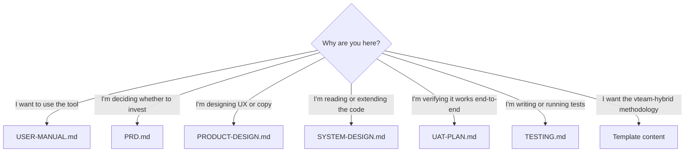

# Documentation index

> **Implementation variant:** Hybrid — in-process agents + subprocess workers, layered on the `noodlefrenzy/vteam-hybrid` template.

A guide to the documentation in this repository. Six chatbot-specific documents below, plus the template's own methodology content (see [§Template content](#template-content)).

## Quick navigation — chatbot docs

| Document | Audience | When to read |
|---|---|---|
| [USER-MANUAL.md](USER-MANUAL.md) | Non-technical users | First-time setup, daily usage, troubleshooting |
| [PRD.md](PRD.md) | Product managers, leads | Understanding what we're building and why |
| [PRODUCT-DESIGN.md](PRODUCT-DESIGN.md) | Designers, product engineers | UX patterns, copy, output formats |
| [SYSTEM-DESIGN.md](SYSTEM-DESIGN.md) | Engineers | Architecture, components, data flow |
| [UAT-PLAN.md](UAT-PLAN.md) | QA, product, anyone signing off | End-to-end acceptance verification |
| [TESTING.md](TESTING.md) | Engineers maintaining the project | Test strategy, mocking, adding tests |

## Which doc do I need?



## Reading order by role

### First-time visitor
1. [README-AGENTS.md](../README-AGENTS.md) — what the chatbot is
2. [USER-MANUAL.md](USER-MANUAL.md) — install and use
3. [PRD.md](PRD.md) — only if you want product context

### Product manager
1. [PRD.md](PRD.md) — vision, goals, KPIs, roadmap
2. [PRODUCT-DESIGN.md](PRODUCT-DESIGN.md) — UX principles, future explorations
3. [UAT-PLAN.md](UAT-PLAN.md) — what's verifiable today

### Engineer joining the project
1. [README-AGENTS.md](../README-AGENTS.md) — chatbot-specific quickstart
2. [SYSTEM-DESIGN.md](SYSTEM-DESIGN.md) — hybrid architecture
3. [TESTING.md](TESTING.md) — how to add tests + subprocess workers
4. [PRD.md](PRD.md) — context on the "why"

### Designer
1. [PRODUCT-DESIGN.md](PRODUCT-DESIGN.md) — principles, IA, copy
2. [USER-MANUAL.md](USER-MANUAL.md) — observe today's actual interactions
3. [PRD.md](PRD.md) — open design questions live here

### QA / acceptance testing
1. [USER-MANUAL.md](USER-MANUAL.md) — what users expect
2. [UAT-PLAN.md](UAT-PLAN.md) — scenarios + sign-off template
3. [TESTING.md](TESTING.md) — what's automated vs manual

## Audience × document matrix

|                 | Non-tech | Product | Design | Engineering | QA |
|-----------------|:---:|:---:|:---:|:---:|:---:|
| USER-MANUAL     | ●●● | ●   | ●   | ○   | ●● |
| PRD             | ○   | ●●● | ●●  | ●   | ●  |
| PRODUCT-DESIGN  | ○   | ●●  | ●●● | ●   | ●  |
| SYSTEM-DESIGN   |     | ●   | ○   | ●●● | ●  |
| UAT-PLAN        | ●●  | ●●  | ●   | ●   | ●●●|
| TESTING         |     |     |     | ●●● | ●  |

●●● primary · ●● useful · ● skim · ○ optional · (blank) skip

## Template content

This repo was created from the [`noodlefrenzy/vteam-hybrid`](https://github.com/noodlefrenzy/vteam-hybrid) template, which ships its own methodology library independent of the chatbot. Those files live alongside the six chatbot docs:

| Path | Source | What it is |
|---|---|---|
| [adrs/](adrs/) | Template | Architecture Decision Records (empty by default) |
| [integrations/](integrations/) | Template | Notes on integrating with external systems |
| [media/](media/) | Template | Diagrams and images used by template docs |
| [methodology/](methodology/) | Template | The vteam-hybrid methodology playbook |
| [process/](process/) | Template | Process docs (kickoff, sprint, retrospective) |
| [research/](research/) | Template | Pre-work and discovery notes |
| [scaffolds/](scaffolds/) | Template | Code-scaffolding guides used by template slash commands |
| [team-directives.md](team-directives.md) | Template | Standing instructions for the project team |
| [template-guide.md](template-guide.md) | Template | How to use the vteam-hybrid template itself |

These are useful if you're adopting the vteam-hybrid methodology more broadly. They do **not** describe the job-search chatbot — that's what the six chatbot docs above are for.

## Conventions across all chatbot docs

- Markdown with `##` and `###` section headings
- Code fences include a language tag (` ```python `, ` ```bash `, ` ```sql `)
- Mermaid diagrams inside ` ```mermaid ` fences
- Tables for personas, scenarios, schemas, KPIs
- Verbatim user-facing copy is in double quotes
- Internal links are relative (e.g. `[USER-MANUAL.md](USER-MANUAL.md)`)

## See also

- [README-AGENTS.md](../README-AGENTS.md) — chatbot-specific overview
- [README.md](../README.md) — template's own README (unmodified)
- [GitHub Issues](../../../issues) — open work items
- [Project board](https://github.com/users/mahadevaiahrashmi/projects/11) — roadmap and triage
- [Sibling implementations](https://github.com/mahadevaiahrashmi?tab=repositories&q=job-chatbot) — the other 4 variants of this product
