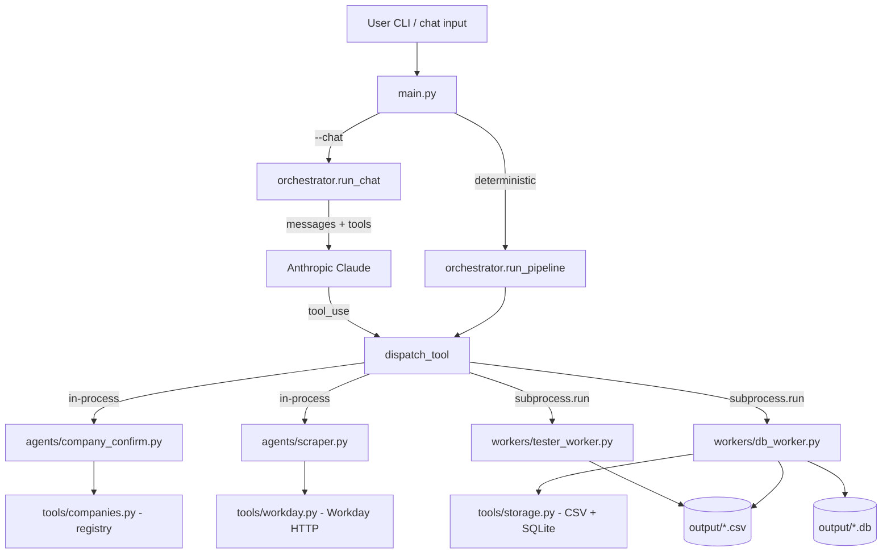

# Job-Search Chatbot — System Design

This document describes the architecture of the chatbot code under
`src/python/job_chatbot/`. It is aimed at developers extending or
debugging the system.

## Problem statement

Job seekers want a fast way to ask "show me the open AI roles at PwC" and
get a structured, downloadable list back. Doing this by hand involves
opening each company's Workday careers site, filtering by keyword, and
copy-pasting the matching postings into a spreadsheet — tedious and
error-prone.

The chatbot automates that loop. It accepts a free-form company name plus
optional keywords and location, calls the company's public Workday search
endpoint, deduplicates results, writes them to CSV + SQLite, and validates
the output. There are four logical agents involved (CompanyConfirm,
Scraper, DB, Tester), each with a single responsibility.

## Why a hybrid architecture

The four agents do not all have the same shape. Two of them (CompanyConfirm
and Scraper) are pure functions over shared in-memory state — they read
the company registry, build HTTP requests, and return Python lists. The
other two (DB and Tester) are side-effectful: DB writes files, Tester
reads files and decides whether they look right. The natural way to
implement each one differs.

**In-process, for tightly-coupled, low-side-effect work:**

- *CompanyConfirm* and *Scraper* share the same `Company` dataclass and
  the same `JobPosting` model. Passing those between agents inside one
  Python process is essentially free — no serialization, no JSON round-trip.
- Both agents are stateless and deterministic given their inputs, so
  there is no isolation benefit to a subprocess.

**Subprocess workers, for isolatable side effects:**

- *DB* writes a CSV and upserts a SQLite database. Even if the script
  crashes mid-write, the orchestrator survives. The contract is "give me
  JSON on stdin, I'll print the artifact paths on stdout."
- *Tester* reads a CSV and exits with a status code. That is exactly the
  shape of a Unix-style validation tool.
- Both workers can be rewritten in another language — Go, Rust,
  TypeScript — without changing the orchestrator, as long as the
  CLI contract (stdin JSON / stdout JSON / exit code) is preserved.

The combination is what `vteam-hybrid` calls "hybrid orchestration":
in-process where it is cheap and tightly-coupled, subprocess where the
isolation pays for itself. The benefits we get:

1. **Crash isolation.** A bug in the DB worker can't take down the
   orchestrator process; the orchestrator just sees a non-zero exit code
   and surfaces it.
2. **Easier testing.** The workers each have a small, stable CLI surface
   that we exercise directly in `tests/test_smoke.py` via
   `subprocess.run([...])`.
3. **Easier extension.** Swapping a worker for a different
   implementation is a drop-in replacement at the CLI boundary.

## High-level architecture



Sequence diagram for a single query:

```mermaid
sequenceDiagram
    participant U as User
    participant O as Orchestrator
    participant CC as CompanyConfirm (in-proc)
    participant SC as Scraper (in-proc)
    participant W as Workday HTTP
    participant DB as db_worker.py (subprocess)
    participant TS as tester_worker.py (subprocess)

    U->>O: "PwC --keywords AI"
    O->>CC: confirm_company("PwC")
    CC-->>O: Company(tenant=pwc, site=Global_Experienced_Careers)
    O->>SC: scrape_jobs(company, "AI", limit=50)
    SC->>W: POST /wday/cxs/pwc/Global_Experienced_Careers/jobs
    W-->>SC: jobPostings[...] (paginated)
    SC-->>O: [dict, dict, ...]
    O->>DB: subprocess.run(db_worker.py --csv ... --db ...) << stdin JSON
    DB-->>O: stdout {"csv":..., "db":..., "rows":N}
    O->>TS: subprocess.run(tester_worker.py --csv ...)
    TS-->>O: stdout {"ok":true, "rows":N, "errors":[]}; exit 0
    O-->>U: summary table + paths
```

## Anthropic SDK orchestrator

`orchestrator.py` exposes the four agents to Claude as tools and runs a
classic tool-use loop. Everything else in the codebase can be exercised
without an API key — the orchestrator is the only place that needs one.

The tools are declared once in a `TOOLS` list (used as the `tools=`
argument to `client.messages.create`). Each tool has an `input_schema`
that mirrors the underlying Python function's signature:

- `confirm_company` → `agents.company_confirm.confirm_company`
- `scrape_jobs` → `agents.scraper.scrape_jobs`
- `persist_jobs` → `subprocess.run([sys.executable, workers/db_worker.py, ...])`
- `validate_csv` → `subprocess.run([sys.executable, workers/tester_worker.py, ...])`

A single `_TOOL_DISPATCH` dict maps tool names to the matching Python
callable. `dispatch_tool(name, args)` is the public entry point that both
the LLM loop and the deterministic pipeline call into.

The LLM loop itself is the standard pattern:

1. Send `messages + tools` to `client.messages.create`.
2. If the response's `stop_reason` is not `tool_use`, concatenate the text
   blocks and return.
3. Otherwise, run each `tool_use` block through `dispatch_tool`, package
   the results as `tool_result` blocks, append both the assistant turn
   and the tool-result turn to the running `messages` list, and loop.
4. Stop after 8 rounds as a safety cap.

A deterministic `run_pipeline(raw_company, ...)` mirrors the same four
steps with no LLM in the loop. It is the path used by the default CLI
mode and by the smoke tests. Tests inject a `scraper=` callable to avoid
hitting the network.

## In-process agents

### `agents/company_confirm.py`

- **Input:** raw user-supplied company string.
- **Logic:** delegates to `tools.companies.resolve_company`, which
  lowercases and collapses whitespace, then checks the registry and the
  alias table.
- **Output:** a `CompanyConfirmation` dataclass with `raw`,
  `canonical_name`, `tenant`, `site`, and a `notes` string suitable for
  surfacing back to the user. `to_dict()` returns the JSON-ready shape.
- **Failure:** if no match is found, returns a `CompanyConfirmation` with
  `company=None` and `notes` listing the supported companies. The
  orchestrator turns this into an error message rather than calling
  `scrape_jobs`.

### `agents/scraper.py`

- **Input:** a resolved `Company`, plus `keywords`, `location`, `limit`.
- **Logic:** calls `tools.workday.search_jobs`, then converts each
  `JobPosting` dataclass to a plain dict via `to_dict()` so the result is
  safe to JSON-serialize through a subprocess boundary.
- **Output:** `list[dict]`, where each dict has the keys `company`,
  `job_id`, `title`, `location`, `posted_on`, `url`.

## Subprocess workers

Both workers are launched with `subprocess.run([sys.executable,
<path>, ...], ...)`. Using `sys.executable` ensures they run inside the
same virtualenv as the orchestrator (no PATH lookups, no shell
interpolation). Each worker also extends `sys.path` to the package root
so it can be executed directly from a checkout (no install needed).

### `workers/db_worker.py`

**CLI contract:**

- **Required args:** `--csv <path>` (output CSV), `--db <path>` (output
  SQLite DB).
- **Optional args:** `--input <path>` to read postings from a file
  instead of stdin (defaults to `-`, i.e. stdin).
- **Stdin:** a JSON array of posting dicts, each with the columns listed
  in `tools.storage.CSV_HEADERS`. An empty stdin is treated as an empty
  list.
- **Stdout:** a single JSON object, e.g.
  `{"csv":"output/pwc_jobs.csv","db":"output/pwc_jobs.db","rows":23,"db_rows":23}`.
- **Stderr / exit:** prints `"Input must be a JSON array of postings."`
  and exits `2` if the payload is malformed. Other unexpected errors
  surface as Python tracebacks on stderr and a non-zero exit.

The worker delegates to `tools.storage.write_csv` (writes the full CSV)
and `tools.storage.write_sqlite` (upserts into the `jobs` table — the
primary key `(company, job_id)` makes the upsert safe to repeat).

### `workers/tester_worker.py`

**CLI contract:**

- **Required args:** `--csv <path>` (the CSV to validate).
- **Optional flag:** `--allow-empty` (treat a CSV with only headers as a
  successful empty result; used by `run_pipeline` so an empty scrape
  doesn't trip the validator).
- **Stdin:** none.
- **Stdout:** a JSON object `{"ok": bool, "rows": int, "errors": [str, ...]}`.
- **Exit code:** `0` if `ok` is true, `1` otherwise.

The validator checks four things:

1. The file exists.
2. The header row matches `tools.storage.CSV_HEADERS` exactly.
3. Every row has a non-blank `job_id` and `url`.
4. No `(company, job_id)` pair appears twice.

Because the worker returns its full result on stdout regardless of exit
code, the orchestrator can show the user the precise list of validation
failures.

## Tools layer

### `tools/workday.py`

- **Endpoint:** `POST {base_url}/wday/cxs/{tenant}/{site}/jobs`.
- **Body:** `{"appliedFacets":{}, "limit":20, "offset":0, "searchText":"..."}`.
- **Pagination:** fixed page size of 20. The loop terminates when the
  response's `jobPostings` array is empty, when `offset >= total`, or
  when `limit` results have been collected.
- **De-duplication:** the regex `_([A-Z0-9-]+WD)(?:-\d+)?$` is applied to
  the response's `externalPath`. A path like
  `.../IN-Senior-..._712616WD-2` reduces to job ID `712616WD`. If the
  regex doesn't match, the last path segment is used as a fallback. The
  scraper keeps a `seen_ids` set to drop duplicate listings within the
  same run.
- **Location filter:** applied client-side as a case-insensitive
  substring match against Workday's `locationsText`.

### `tools/companies.py`

A frozen `Company` dataclass plus two dictionaries:

- `_REGISTRY` — keyed by lowercase tenant; values are `Company(canonical_name,
  base_url, tenant, site)`.
- `_ALIASES` — lowercase aliases mapping to a registry key (e.g. `"pwc india" → "pwc"`).

`resolve_company(name)` lowercases and collapses spaces in the input,
then checks the registry first and the alias table second. `known_companies()`
returns the sorted canonical names for help text and error messages.

### `tools/storage.py`

- `CSV_HEADERS = ["company", "job_id", "title", "location", "posted_on", "url"]`.
- `write_csv(rows, path)` — creates parent dirs, writes a header row, then
  one row per posting. Returns the row count.
- `write_sqlite(rows, path)` — runs `_SCHEMA` (which is idempotent thanks
  to `CREATE TABLE IF NOT EXISTS`), then issues an upsert per row keyed
  on the composite primary key `(company, job_id)`. Returns the count of
  rows touched.

## Data flow

End-to-end for the query "find AI jobs at PwC in Bangalore":

1. `main.py` parses argv: `company="PwC"`, `keywords="AI"`,
   `location="Bangalore"`, `limit=50`.
2. It calls `run_pipeline("PwC", keywords="AI", location="Bangalore", ...)`.
3. `run_pipeline` calls `confirm_company("PwC")` in-process.
   `tools.companies.resolve_company` returns the `Company(canonical_name=
   "PricewaterhouseCoopers", base_url="https://pwc.wd3.myworkdayjobs.com",
   tenant="pwc", site="Global_Experienced_Careers")` record.
4. It computes `output/pwc_jobs.csv` and `output/pwc_jobs.db`.
5. It calls `scrape_jobs(company, keywords="AI", location="Bangalore",
   limit=50)` in-process.
6. `tools.workday.search_jobs` POSTs to
   `https://pwc.wd3.myworkdayjobs.com/wday/cxs/pwc/Global_Experienced_Careers/jobs`,
   paginates until the limit is hit or the endpoint returns no more
   results, deduplicates by extracted job ID, and applies the
   Bangalore location filter.
7. `_tool_persist_jobs` shells out:
   `python workers/db_worker.py --csv output/pwc_jobs.csv --db output/pwc_jobs.db`
   with the JSON array of postings on stdin. The worker writes both
   artifacts and prints the summary.
8. `_tool_validate_csv` shells out:
   `python workers/tester_worker.py --csv output/pwc_jobs.csv --allow-empty`.
   The validator parses the CSV, returns the result on stdout, and exits
   `0` if there are no errors.
9. `main.py` renders a Rich table of the first 20 postings plus the CSV
   and DB paths.

## Persistence layer

**CSV format.** UTF-8, comma-delimited, one header row with the six
columns of `CSV_HEADERS`. One row per posting. Missing fields are
written as empty strings rather than omitted.

**SQLite schema.**

```sql
CREATE TABLE IF NOT EXISTS jobs (
    company   TEXT NOT NULL,
    job_id    TEXT NOT NULL,
    title     TEXT NOT NULL,
    location  TEXT,
    posted_on TEXT,
    url       TEXT,
    PRIMARY KEY (company, job_id)
);
```

Re-running with the same company upserts into the table. Re-running with
a different company adds rows without touching the existing ones — the
database is cumulative across runs.

## Failure modes & recovery

| Source | Failure | What happens |
| ------ | ------- | ------------ |
| CompanyConfirm | Unknown company | `confirm_company` returns `company=None`; `run_pipeline` returns a `PipelineResult` with `company=None` and a clear error in `validation["errors"]`. `main.py` prints the error in red and exits `1`. |
| Scraper | Workday HTTP error | `httpx` raises; the exception bubbles up through `run_pipeline` (or, in chat mode, is caught by `run_chat` and returned to Claude as `tool_result.is_error=True`). |
| DB worker | Subprocess crash | `subprocess.run(..., check=True)` raises `CalledProcessError` containing stderr. The orchestrator surfaces this. Because writes happen inside the worker, the orchestrator process is not corrupted. |
| Tester worker | CSV validation fails | The worker exits `1` but still prints its full result JSON on stdout. `_tool_validate_csv` uses `check=False` so the exit code does not raise — instead the result is returned to the caller and `main.py` exits `1` to signal the failure. |
| Anthropic loop | Runs more than 8 tool-use rounds | `run_chat` returns the string `"Reached tool-use round limit without final answer."`. |

The key design property: in-process agent failures raise Python
exceptions; subprocess worker failures are visible as non-zero exit codes
plus structured JSON output. Both paths give the orchestrator enough
information to compose a useful error message.

## Testing strategy

`tests/test_smoke.py` contains 13 test functions (one is parameterized
across two workers, so pytest collects 14 cases). All tests run fully
offline — neither Workday nor the Anthropic API is touched. The coverage
breaks down as:

- **Regex / scraper internals (3):** `_extract_job_id` for the WD suffix
  case, the full externalPath case, and the fallback case.
- **Company registry (3):** PwC alias resolution, total company count
  (currently 8), and the "unknown company" path.
- **Storage round-trip (2):** `write_csv` + `write_sqlite` + `validate_csv`
  on a small fixture, plus a negative test for duplicate detection.
- **Pipeline (2):** `run_pipeline` with a stub scraper (asserts the CSV
  and DB land on disk and validation passes); `run_pipeline` with an
  unknown company (asserts the error path).
- **Workers (3):** `--help` works for both workers (parameterized into 2
  cases) and a full DB-then-Tester subprocess round-trip that mirrors
  what the orchestrator does at runtime.
- **Misc (1):** the package's `__version__` is exposed.

Run with `uv run pytest -q`.

## Relationship to the template

This repo started as a clone of the `noodlefrenzy/vteam-hybrid` template.
The template ships:

- Claude Code agent personas under `.claude/agents/` (Archie, Cam, Dani,
  etc.) and slash commands under `.claude/commands/` (`/kickoff`,
  `/plan`, `/tdd`, ...).
- Methodology and process documentation under `docs/methodology/` and
  `docs/process/`.
- Sample sprints under `samples/` (`hello-tdd`, `full-sprint`, etc.).
- Top-level `README.md`, `README-template.md`, `CLAUDE.md`, `CHANGELOG.md`.

**Nothing in the template was removed or modified.** The chatbot is
strictly additive:

- New code under `src/python/job_chatbot/`.
- New tests under `tests/`.
- New documentation under `docs/USER-MANUAL.md` and `docs/SYSTEM-DESIGN.md`
  (this file).
- A new top-level `README-AGENTS.md` summarizing the chatbot for both
  end users and developers.
- New `pyproject.toml`, `.env.example`, and `output/.gitkeep`.

If you are looking for the canonical entry point into the chatbot, start
at `README-AGENTS.md`. The template's `README.md` documents the template
itself and is independent of this project.

## Security & cost

- **No credentials are sent to Workday.** The endpoints are the same
  unauthenticated JSON APIs that the careers websites use.
- **No data leaves the machine** unless `--chat` is enabled, in which
  case the user prompt and tool results are sent to Anthropic. Job
  posting payloads can include role descriptions; treat that as you
  would any other API call.
- **API cost (chat mode only):** a typical query needs 4 tool-use rounds
  against Claude 3.5 Sonnet. At current pricing that is roughly a few US
  cents per query. The default pipeline mode costs nothing.

## Extension points

- **New worker in another language.** Drop an executable next to the
  existing workers under `src/python/job_chatbot/workers/`, then update
  the `_DB_WORKER` / `_TESTER_WORKER` path in `orchestrator.py` to point
  at it. The replacement must read a JSON array on stdin (DB worker) or
  accept `--csv <path>` (Tester) and must print its result as a JSON
  object on stdout. Exit codes are interpreted as described above.
- **New in-process agent.** Add a module under `agents/`, expose a tool
  entry in `orchestrator.TOOLS`, add a dispatcher in `_TOOL_DISPATCH`,
  and (optionally) extend `run_pipeline` to call it in the deterministic
  path. Add a smoke test that exercises the agent without network.
- **New company.** Add a `Company(canonical_name, base_url, tenant,
  site)` entry to `_REGISTRY` in `tools/companies.py`, plus any aliases
  to `_ALIASES`. Bump the `test_known_companies_count` assertion.
- **Different LLM model.** `run_chat(user_message, model=...)` accepts
  a model string. Change the default at the top of `run_chat`.

## Future work

- **Cross-run dedup:** today the SQLite DB upserts but the CSV is
  overwritten per run. Could add a "--append" flag to merge new
  postings into an existing CSV.
- **More companies:** the registry approach scales linearly. A
  long-term improvement is auto-discovery of `tenant` / `site` from a
  company's careers URL.
- **Caching:** Workday responses could be cached on disk for repeat
  queries.
- **Streaming output:** for chat mode, stream Claude's text blocks to the
  terminal instead of buffering the whole reply.
- **Richer validation:** the tester worker could check posting freshness
  (`posted_on` parseable) and URL liveness (HEAD request).
- **Web UI:** the orchestrator is already structured around a tool-use
  loop, which makes a small FastAPI wrapper straightforward.
